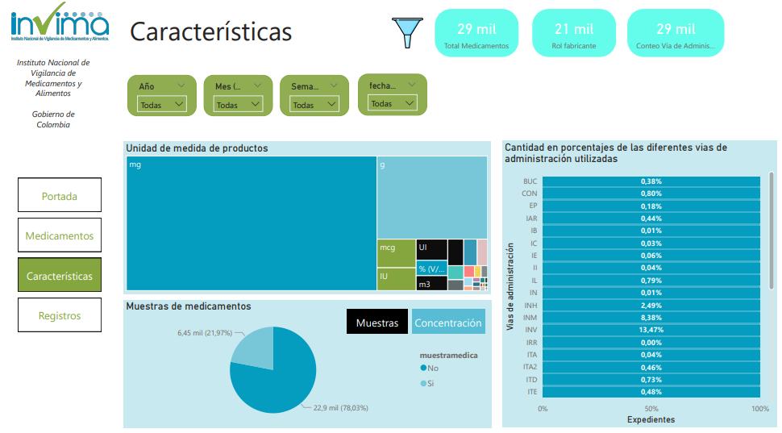

# 🔬 Análisis de patrones de prescripción en pacientes con diabetes (RWE)

Este proyecto analiza datos reales de salud (Real World Evidence - RWE) para identificar los medicamentos más utilizados en pacientes con diabetes y sus vías de administración (oral, inyectable, etc.).

El objetivo es transformar datos crudos en información útil para la toma de decisiones en contextos de salud, investigación clínica y farmacéuticas.

---

## 🛠 Tecnologías utilizadas

| Herramienta / Lenguaje | Uso en el proyecto |
|------------------------|-------------------|
| **SQL**                | Limpieza y transformación de la base de datos |
| **Power BI**           | Dashboard interactivo con visualizaciones |
| **Python (pandas, matplotlib)** | Exploratory Data Analysis (EDA) y automatización |
| **Excel**              | Validación y estructura inicial del dataset |

---

## 📊 Resultados principales

✅ Identificación de los medicamentos más utilizados en pacientes con diabetes  
✅ Distribución según vía de administración (oral vs. inyectable)  
✅ Dashboard interactivo para análisis dinámico  
✅ Aplicación de conceptos de *Real World Evidence (RWE)*

---

## 📁 Estructura del repositorio

📦 diabetes-rwe-analysis
┣ 📂 dashboard
┃ ┗ proyecto_final.pbix
┣ 📂 data
┣ 📂 notebooks
┃ ┗ diabetes_EDA.ipynb (opcional si se agrega notebook Python/R)
┗ README.md

yaml
Copiar código

---

## 🚀 Dashboard (Power BI)

Vista previa del dashboard:

---

### 📌 Características de la población analizada

### 💊 Medicamentos y vías de administración

### 📈 Registros y volumen de datos analizados

---

> Para ver el archivo completo del dashboard:
📁 `/dashboard/Adobato Ana Paula, proyecto final.pbix`

---

## 🧠 Aprendizajes

- Interpretación de datos clínicos desde la perspectiva de salud
- Conexión entre datos técnicos y decisiones clínicas
- Preparación de un flujo reproducible (SQL → Python → Power BI)

---

## 👩‍⚕️ Sobre mí

Ana Paula Adobato  
**Clinical Data Analyst | Bioinformática y Bioestadística (Junior)**  
Python · R · SQL · Bioinformática · Bioestadística · RWE

🔗 LinkedIn: https://www.linkedin.com/in/ana-paula-adobato  
